# Library-Management-System

ShelfMinder is developed for transforming manual offline workloads into an online automatic system. It contains all the main features such as adding and managing students, and books with efficiently maintaining their data. It is a multi-user portal. It also contains other security features such as Captcha Verification and Password Encryption. This is a complete LMS with all the necessary functionalities. It also provides a feature to generate reports and manage fine. Also has the option to upload cover pages of the book for easier identification.

# Getting Started

These instructions will get you a copy of the project up and running on your local machine for development and testing purposes. 

## Prerequisites

It is good to have basic knowledge of HTML, CSS, PHP, and MySQL to understand this project.
>We will use the XAMP server as it has cross-platform support and we won't be needed to worry about the operating system support.
Download and install a suitable XAMP server from this link - https://www.apachefriends.org/download.html

## Setting up the environment

- Download and extract project source code on your local machine.
- Paste the source code in the htdocs folder. Default path will be here("C:\xampp\htdocs")
- Open XAMP Control Panel and start Apache & MySQL service
- Open your web browser and paste this link ("http://localhost/phpmyadmin/"). It should open the database server page.
- Create a new empty database named library. Select the library database and import the SQL file given with the source code.
- Review the config file from both of the included folders. Change username and password accordingly.
- Open your web browser and paste this link ("http://localhost/foldername-in-htdocs-directory/"). It should open the login page.
- Use any credentials from the database to log in.

# Screenshots

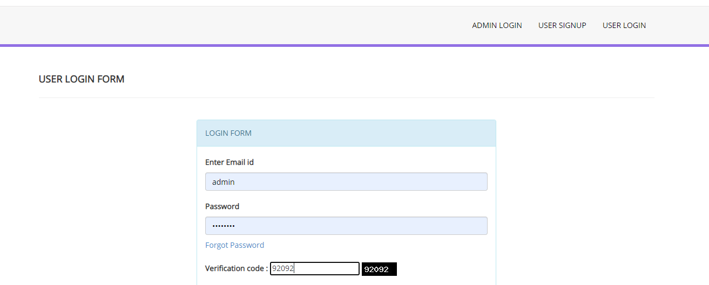

***

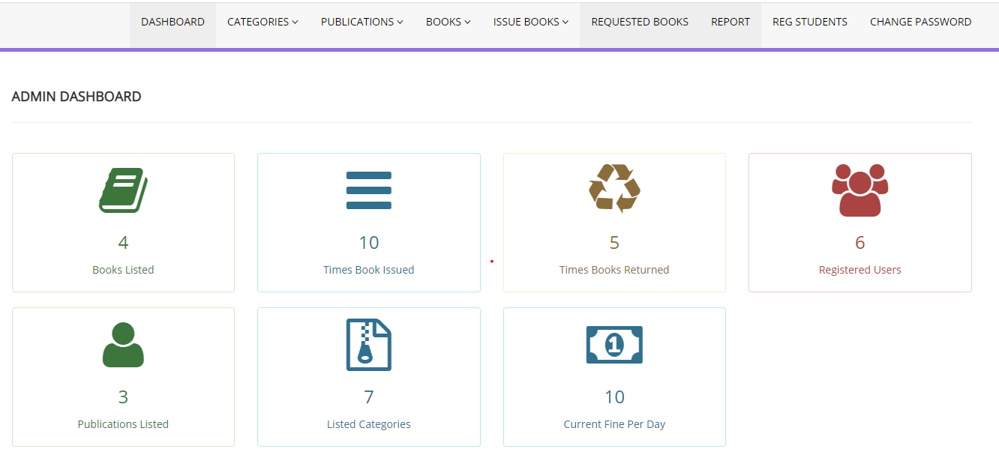
***

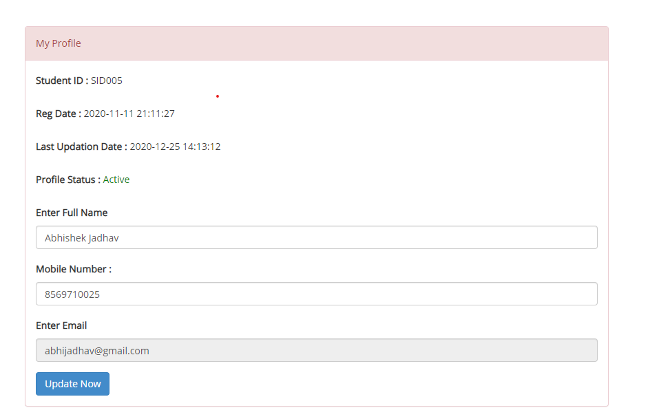

***

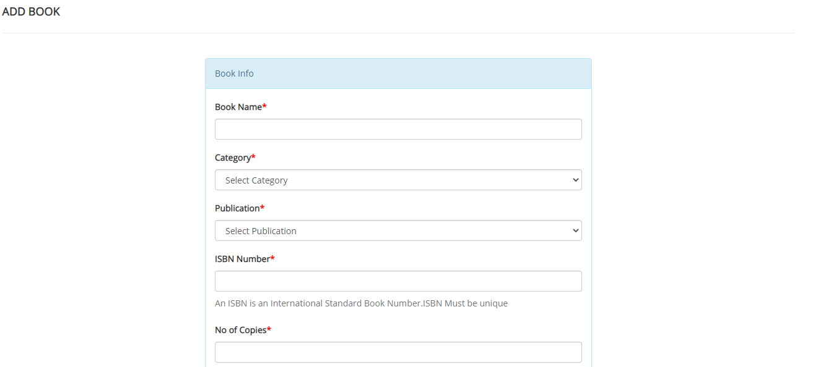

***

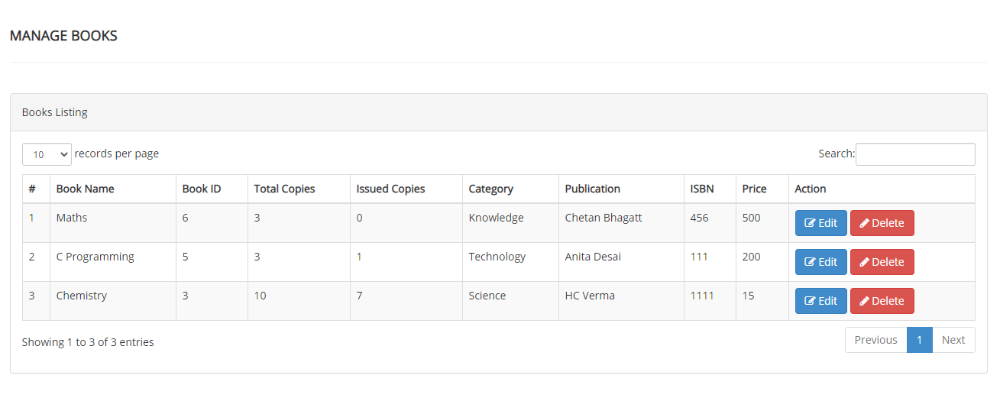

***

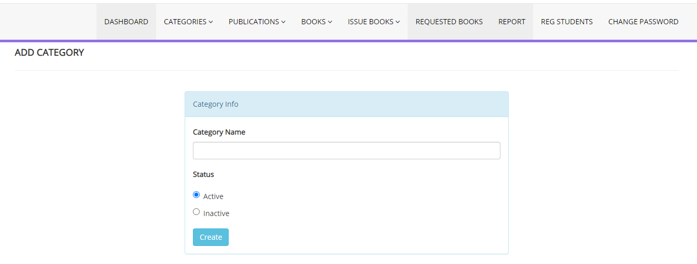

***

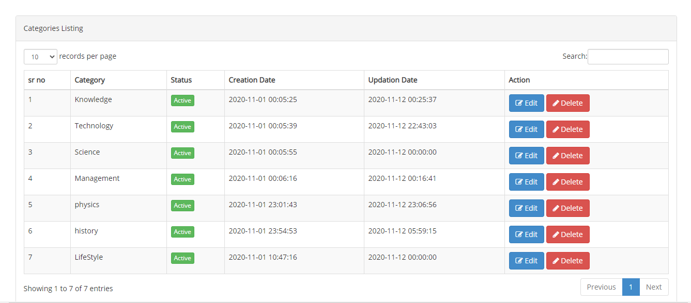

***

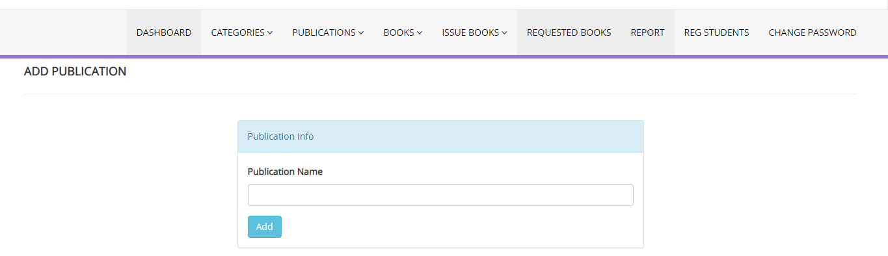

***

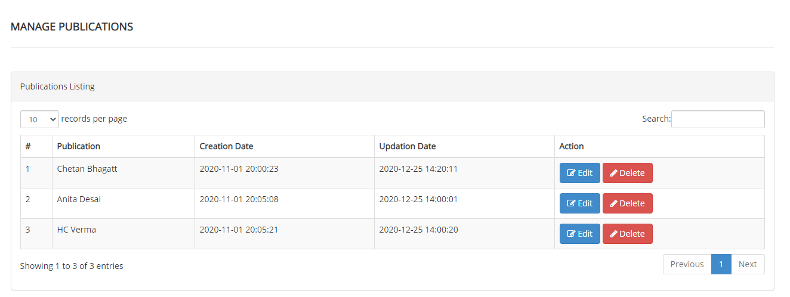

***

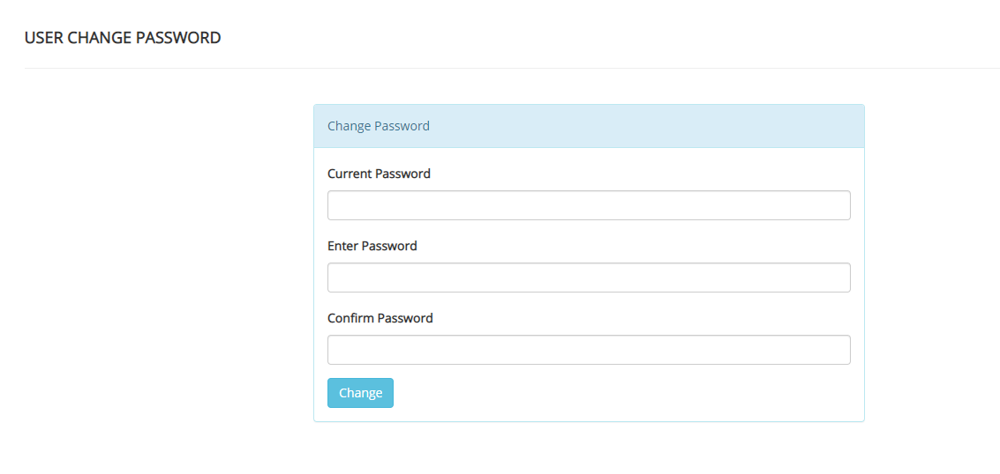

***

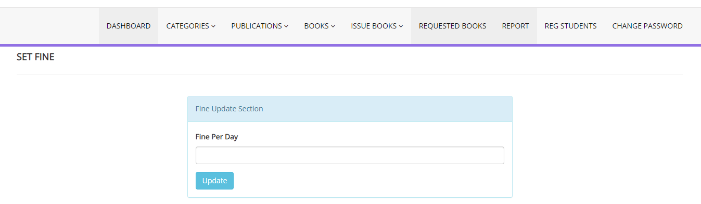

***

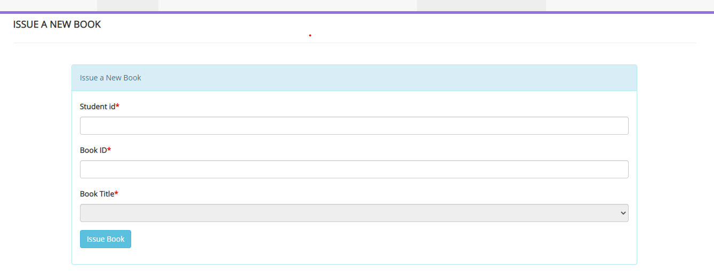

***

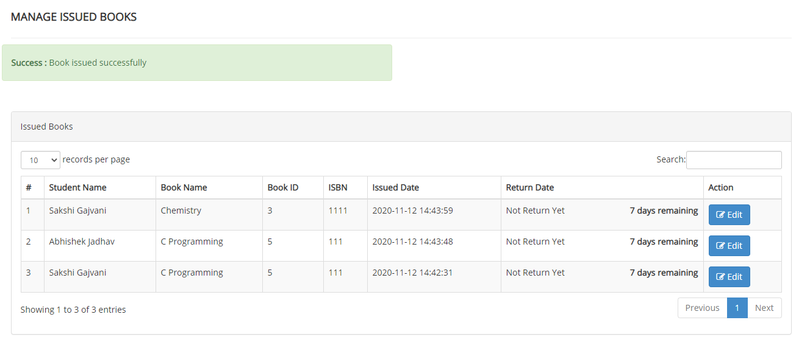

***

***

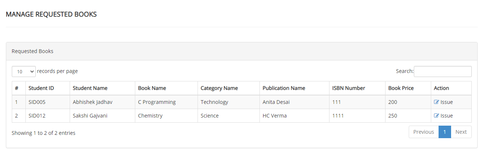

***

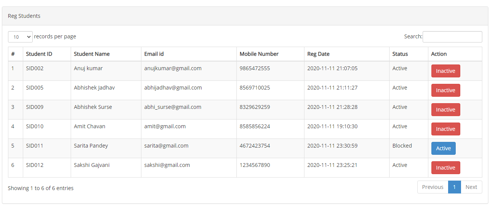

***

***

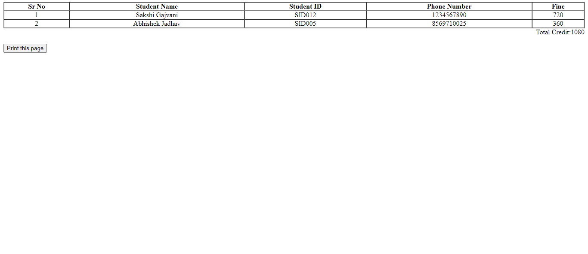

***

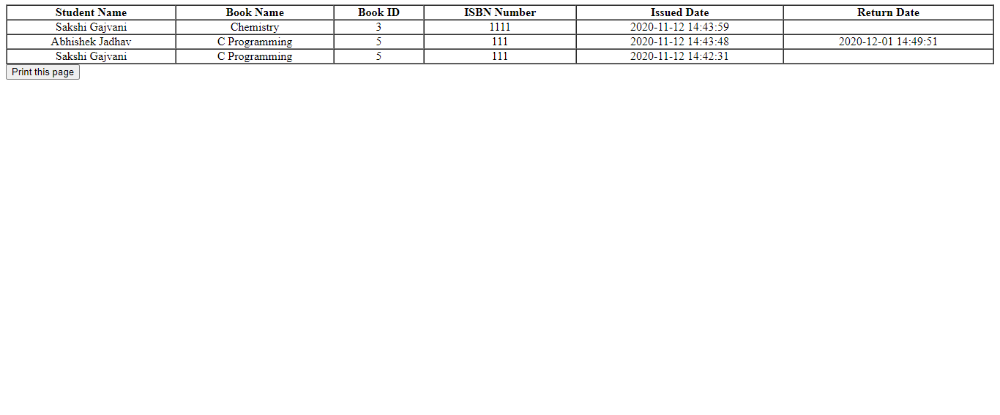
